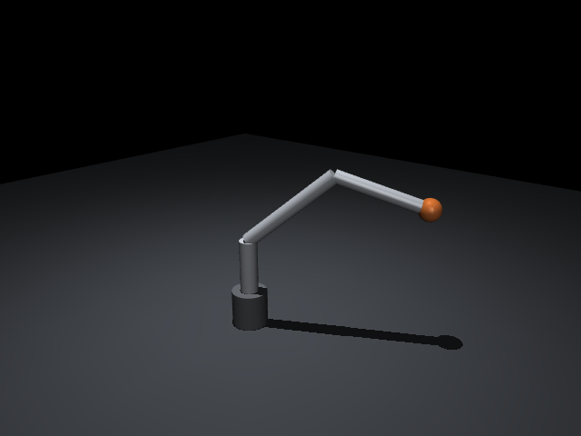
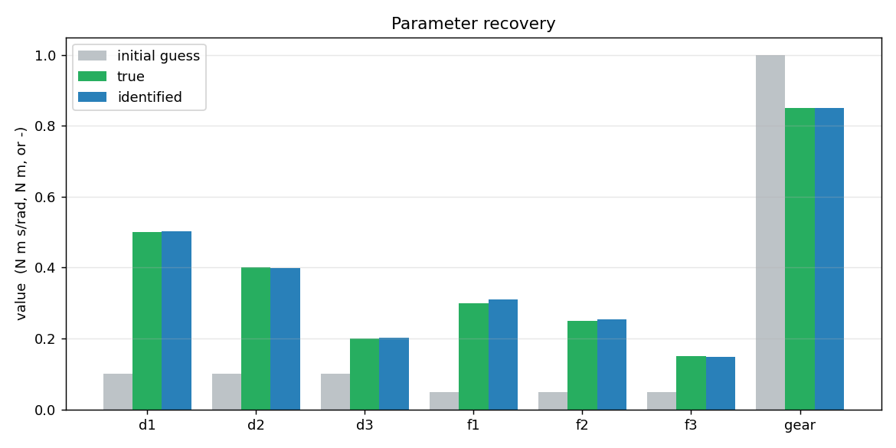
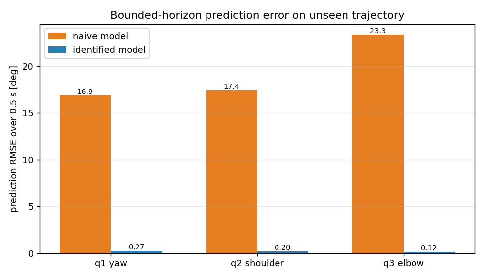
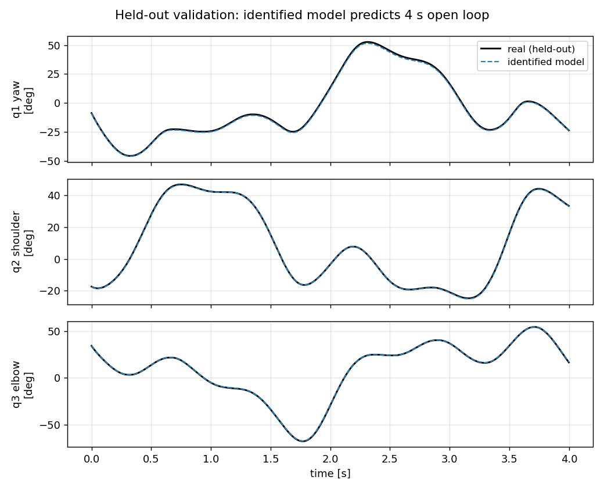

# Project 1: High-Fidelity Arm Model + Sim-to-Real Parameter Identification

A 3-DOF manipulator modelled in MuJoCo (MJCF) with analytically derived link
inertials, plus a system-identification pipeline that recovers the joint
friction, damping, and true motor torque constant from noisy trajectory data
and validates the result on motion it never saw during fitting.

The theme is the part of sim-to-real that most models get wrong: geometry and
mass are easy to get right, but friction, damping, and the actual delivered
motor torque are not on any drawing and have to be measured. This project does
both halves rigorously.



## Why this is built the way it is

**Inertials are computed, not guessed.** Each link is a real aluminium tube
with an outer radius, wall thickness, and length. `src/inertia.py` derives the
full inertia tensor of each link about its center of mass and rotates it into
the body frame, then `src/build_arm.py` writes those tensors straight into the
MJCF `<inertial>` elements. There are no identity tensors and nothing is left to
MuJoCo's bounding-box auto-derivation. This is the same mass-properties
discipline a mechanical designer applies in CAD, carried into the simulator
where the dynamics actually depend on it.

Standalone mass-properties report:

```
$ python src/inertia.py
link                    mass[kg]       Ixx       Iyy       Izz
link1_shoulder_riser      0.2341  5.01e-04  5.01e-04  1.25e-04
link2_upper_arm           0.2825  9.73e-05  2.17e-03  2.17e-03
link3_forearm             0.2099  5.76e-05  1.12e-03  1.12e-03
payload_sphere            0.5000  1.80e-04  1.80e-04  1.80e-04
TOTAL moving mass         1.2265 kg
```

Note that for the upper arm, laid along its own long axis, the axial moment
(9.7e-5) is far smaller than the transverse moments (2.2e-3). A guessed diagonal
would almost never capture that anisotropy, and the swing dynamics would be
wrong as a result.

## The identification problem

We treat one MJCF as the "real robot" and hide three things inside it that a
first-pass model would get wrong:

| quantity | per joint | truth |
|---|---|---|
| viscous damping | d1, d2, d3 | 0.50, 0.40, 0.20 N·m·s/rad |
| dry friction (frictionloss) | f1, f2, f3 | 0.30, 0.25, 0.15 N·m |
| motor torque constant (gain) | gear | 0.85 (motor delivers 85% of nominal) |

The pipeline (`src/system_id.py`):

1. Excites the "real" arm with a rich multi-sine motion under PD tracking, and
   logs the commanded joint torques together with noisy joint-angle
   measurements. Frequencies are chosen to force velocity reversals so dry
   friction is observable, across a spread of speeds so viscous damping is
   observable.
2. Starts from a deliberately wrong nominal model (friction and damping
   underestimated, motor assumed to deliver full nominal torque) and identifies
   all seven parameters by minimising a **multiple-shooting** prediction error.
   Multiple shooting re-anchors the model on the measured state periodically,
   which keeps the fit well-posed and forces the model dynamics, not a one-step
   curve fit, to explain the data.
3. Validates on a **different** trajectory generated with different phases, so
   the test measures whether the sim-to-real gap actually closed rather than
   whether the fit memorised its training data.

## Results

Parameters are recovered to about **1.1% mean error**, with the motor gain
pinned to within 0.1%:

```
param    true    init     id      |err|%
d1      0.500   0.100   0.502     0.37
d2      0.400   0.100   0.399     0.36
d3      0.200   0.100   0.201     0.72
f1      0.300   0.050   0.311     3.71
f2      0.250   0.050   0.254     1.71
f3      0.150   0.050   0.149     0.77
gear    0.850   1.000   0.851     0.09
mean identified-parameter error: 1.11%
```



On the held-out trajectory, a bounded 0.5 s prediction horizon (both models
re-anchored to truth every 0.5 s, so the comparison is fair and finite) gives:

| joint | naive model RMSE | identified model RMSE | reduction |
|---|---|---|---|
| q1 yaw | 16.9° | 0.27° | 98.4% |
| q2 shoulder | 17.4° | 0.20° | 98.8% |
| q3 elbow | 23.3° | 0.12° | 99.5% |



And the identified model tracks the real arm across the full 4 s open-loop
prediction, from a single initial state:



## Mapping to the role

- **High-fidelity MJCF with accurate kinematics, dynamics, contact properties** —
  analytic inertials injected into MJCF; motor actuators with realistic gain.
- **Tune physics parameters (friction, damping, inertia, actuator models) for
  sim-to-real** — the entire identification pipeline, validated out of sample.
- **End-to-end simulation pipeline for testing and validation** — excitation,
  data logging, identification, and out-of-sample validation in one runnable
  script.
- **ROS2 integration** — `src/ros2_bridge.py` runs the model as a sim server
  that publishes `/joint_states` and accepts torque commands (see its docstring
  for the run recipe; ROS2 is not installed in this repo's CI sandbox).
- **Clean, performant Python** — vectorised NumPy, live model-parameter mutation
  without XML recompilation, SciPy trust-region least squares.

## Run it

```bash
pip install mujoco numpy scipy matplotlib
python src/inertia.py            # mass-properties report
python src/build_arm.py          # (re)generate models/arm3.xml
MUJOCO_GL=egl python src/system_id.py   # identify + write figures to results/
```

## Files

```
src/inertia.py       analytic inertia tensors from geometry + material
src/build_arm.py     MJCF generator that bakes in the computed inertials
src/system_id.py     excitation, identification, validation, figures
src/ros2_bridge.py   rclpy node: sim as a ROS2 joint-state server
models/arm3.xml      generated model
results/             figures and summary.txt
```
