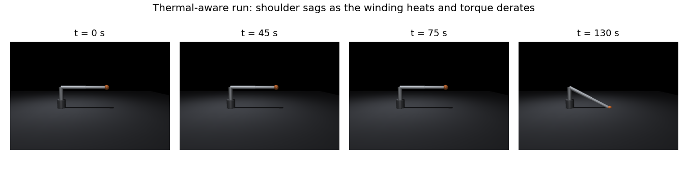
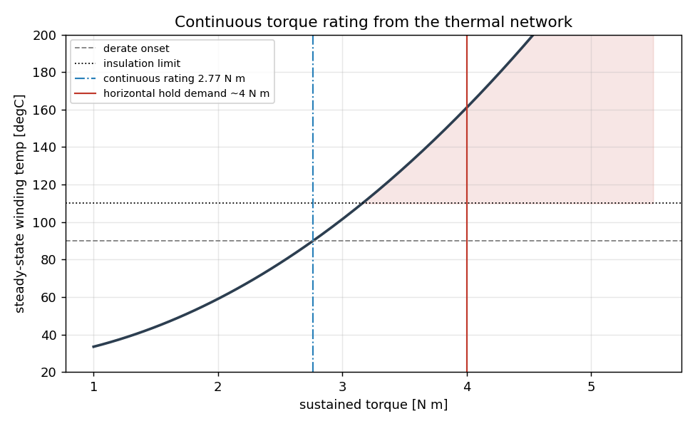
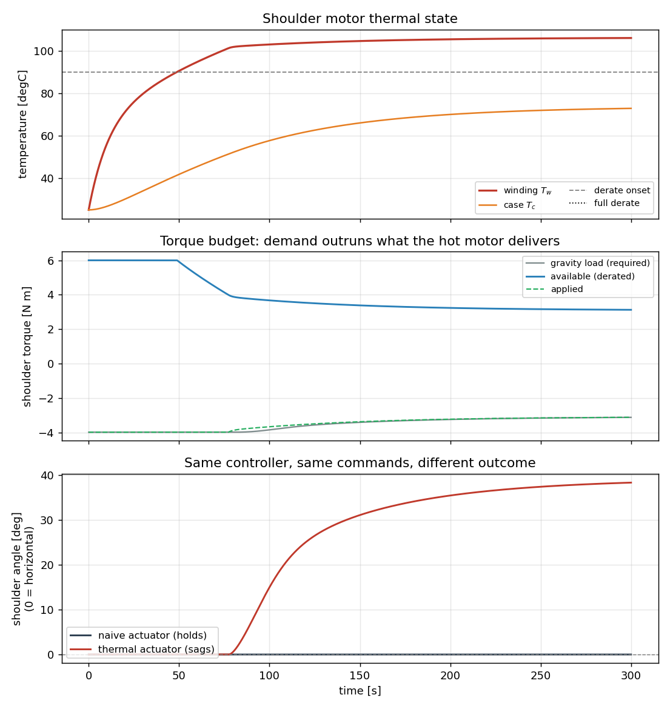

# Project 2: Thermally Coupled Actuator Model for Sim-to-Real Torque Limits

A physics-based motor thermal model coupled into a MuJoCo simulation, capturing
a sim-to-real gap that friction and damping identification do not: sustained
torque derating. A joint asked to hold a heavy pose heats its windings, the
drive derates torque to protect the insulation, and the achievable torque
falls. A simulator that treats peak torque as always available will let a
controller command holds the real hardware cannot sustain.



## The physics

Torque is proportional to motor current, and copper loss scales with the square
of current, so holding torque dissipates `I^2 R` in the windings. That heat is
modelled with a two-node lumped-capacitance thermal network, the same
resistance-capacitance abstraction used across electronics cooling, here mapped
onto the motor:

```
P_cu = c_loss * tau^2                      copper loss (c_loss bundles R / kt^2)
Cw dTw/dt = P_cu - (Tw - Tc)/R_wc          winding node
Cc dTc/dt = (Tw - Tc)/R_wc - (Tc - Ta)/R_ca   case node
```

Torque available to the controller rolls off linearly once the winding passes a
derate threshold and is clamped at an insulation limit. The model
(`src/thermal_actuator.py`) also exposes closed-form analysis so the actuator
can be sized, not just simulated:

```
$ python src/thermal_actuator.py
peak torque              : 6.00 N m
continuous torque limit  : 2.77 N m
winding time constant    :   10.6 s
case time constant       :  169.4 s
  hold 3.00 N m -> steady winding  101.5 degC
  hold 4.00 N m -> steady winding  161.0 degC
```

The continuous rating (2.77 N·m) and the two time constants come straight from
the network: the rating is the torque whose steady-state winding temperature
equals the derate threshold, and the time constants are the eigenvalues of the
2x2 state matrix (a fast winding node and a slow case node).



## The demonstration

The arm holds a fully extended horizontal pose with a payload, which demands
about 4 N·m at the shoulder, well above the 2.77 N·m continuous rating. The
controller is a correct gravity-compensating PD law and is identical in both
runs. The only thing that changes is the actuator model:

| | naive actuator | thermal actuator |
|---|---|---|
| torque availability | peak, always | derates with winding temperature |
| final shoulder angle | 0.0° (holds horizontal) | 38.4° (sags) |
| peak winding temp | n/a | 106 °C |

The naive arm holds horizontal indefinitely. The thermal arm holds, heats past
the derate threshold at roughly 55 s, loses the torque to fight gravity, and
sags to a drooped equilibrium where the reduced gravity torque matches what the
hot motor can still deliver. Same controller, same commands, different outcome.
That is the failure mode a thermal-blind sim hands to hardware.



The three panels show the mechanism end to end: the winding crosses the derate
threshold (top), the available torque falls below the gravity demand (middle),
and the joint that held in the naive case sags in the thermal case (bottom).

## Why this is a differentiator

This is the electronics-cooling and lumped-network thermal modelling I work in,
carried into robotics simulation. Most sim-to-real effort tunes friction,
damping, and inertia. Very little of it models the actuator as a thermal device,
even though sustained-load derating is a real and common reason a sim-tuned
policy underperforms on hardware. The model here is small, physically grounded,
and drops into any torque-controlled joint.

## Mapping to the role

- **Actuator models tuned for sim-to-real** — a first-principles thermal
  actuator that changes the achievable torque envelope, which is the crux of
  sim-to-real for high-duty holds.
- **Physics parameter tuning** — thermal resistances, capacitances, and the
  loss coefficient are the parameters; the closed-form rating and time-constant
  analysis show how to choose them.
- **Simulation pipeline and validation** — a reproducible A/B (naive vs
  thermal) with quantitative outcomes and rendered evidence.
- **Clean Python** — the thermal model is a small, well-documented, dependency-
  light class that composes with any MuJoCo torque-controlled model.

## Run it

```bash
pip install mujoco numpy matplotlib
python src/thermal_actuator.py          # characterisation report
MUJOCO_GL=egl python src/run_thermal_demo.py   # A/B demo + figures
```

## Files

```
src/thermal_actuator.py   two-node thermal network + derating + analysis
src/run_thermal_demo.py   couples it to the arm, runs naive vs thermal, plots
models/arm_thermal.xml    3-DOF arm (unit motor gain)
results/                  figures and summary.txt
```

## Extensions worth doing next

- Identify the thermal parameters (c_loss, resistances, capacitances) from a
  bench heat-up run, exactly as Project 1 identifies the mechanical parameters.
- Feed winding temperature back into a thermally aware controller that trades
  pose for duty cycle instead of stalling hot.
- Add winding temperature to the observation of an RL policy so it learns the
  thermal budget rather than discovering it on hardware.
